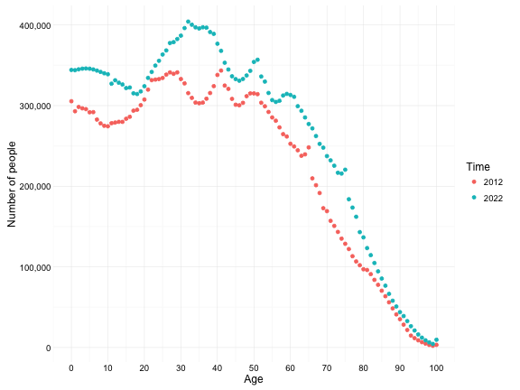
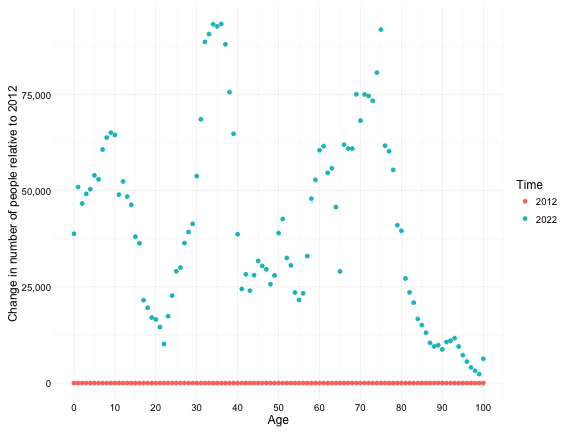

Australian population projections
========================================================
author: Vlad Fridkin
date: Feb 2016

Why is this interesting?
========================================================
It's common knowledge in Australia that the proportion of elderly people is increasing.
Instead of reading it in the news or hearing it from other people, it is good to explore
the underlying data to confirm if this is true, and also to
- obtain the actual numbers
- understand the assumptions 
- discover other effects on population

Totals by age
========================================================
Assuming **medium** fertility, life expectancy and net overseas migration,
people numbers increase disproportionately across the distribution of ages.

Changes between 2012-22
========================================================
Increases in the 70-80 age group are consistent with an aging population. 
Interestingly the 30-40 age group grows even more.  This is due to
to immigration as demonstrated [here]
(https://vfridkin.shinyapps.io/AusPop/).

Source of population projection data
========================================================
Data was sourced from the **Australian Bureau of Statistics** 

The data can be downloaded from 
[Population Projections, Australia, 2012-2101]
(http://stat.abs.gov.au/Index.aspx?DatasetCode=POP_PROJ_2011)

The data set is too big to download at once, so only 11 years of data (2012-2022) was extracted, lightly formatted with Excel (such as removal of descriptions and filling in of empty factor cells) and data wrangled with R.
